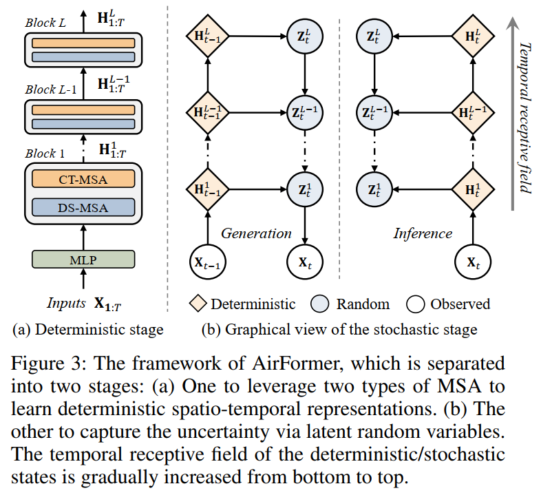

# AirFormer

This repo is the implementation of our manuscript entitled [AirFormer: Predicting Nationwide Air Quality in China with Transformers](https://arxiv.org/pdf/2211.15979.pdf). In this study, we present a novel Transformer architecture termed AirFormer to collectively predict nationwide air quality in China over the next 72 hours, with an unprecedented fine spatial granularity covering thousands of locations. The source code is well commented.

*This is an implementation of AirFormer using Pytorch 1.10, tested on Ubuntu 16.04 with a NVIDIA RTX A6000 GPU with 48 GB memory.*


## Framework



## Requirements

AirFormer uses the following dependencies: 

* [Pytorch 1.10](https://pytorch.org/get-started/locally/) and its dependencies
* Numpy and Scipy
* CUDA 11.3 or latest version. And **cuDNN** is highly recommended


<!-- If you find this code and dataset useful for your research, please cite our paper:

```
``` -->

## Dataset 
The air quality (and meteorology) dataset we use in our paper is larger than 500GB, which cannot be easily shared in this appendix. Thus we process a tiny version of our dataset to facilitate the understanding of the source code. This tiny version consists of 20 training instances, 20 validation instances, and 20 test instances. 


## Folder Structure
We list the code of the major modules as follows:
- The main function to train/test our model: [click here](experiments/airformer/main.py).
- The source code of our model: [click here](src/models/airformer.py).
- The trainer/tester: [click here](src/trainers/airformer_stochastic_trainer.py)/[click here](src/trainers/airformer_trainer.py)/[click here](src/base/trainer.py)
- Data preparation and preprocessing are located at [click here](src/utils/helper.py).
- Metric computations: [click here](src/utils/metrics.py).
- *Before running our code, please unzip the files under the data folder.*

## Arguments
We introduce some major arguments of our main function here.

Training settings:
- mode: indicating the mode, e.g., training or test
- gpu: using which GPU to train our model
- seed: the random seed for experiments
- dataset: which dataset to run
- base_lr: the learning rate at the beginning
- lr_decay_ratio: the ratio of learning rate decay
- batch_size: training or testing batch size
- seq_len: the length of historical steps
- horizon: the length of future steps
- input_dim: the dimension of inputs
- output_dim: the dimension of inputs
- max_epochs: the maximum of training epochs
- patience: the patience of early stopping
- save_preds: whether to save prediction results

Model hyperparameters:
- n_hidden: hidden dimensions in CT-MSA and DS-MSA
- dropout: dropout rate
- dartboard: which dartboard partition to use. 0: 50-200, 1: 50-200-500, 2: 50, 3: 25-100-250.
- stochastic_flag: whether to turn on the stochastic stage
- spatial_flag: whether to turn on DS-MAS

## Model Training
Before running our code, please add the path of this repo to PYTHONPATH.
```
export PYTHONPATH=$PYTHONPATH:"the path of this repo"
```

The following examples are conducted on the tiny dataset:
* Example 1 (AirFormer with default setting):
```
python ./experiments/airformer/main.py --mode train --gpu 0 --dataset AIR_TINY
```

* Example 2 (AirFormer with the 50-200-500 dartboard, 16 hidden channels):
```
python ./experiments/airformer/main.py --mode train --gpu 0 --dataset AIR_TINY --dartboard 1 --n_hidden 16
```

* Example 3 (AirFormer without latent variables):
```
python ./experiments/airformer/main.py --mode train --gpu 0 --dataset AIR_TINY --stochastic_flag False
```

## Model Test
To test above trained models, you can use the following command to run our code:
* Example 1 (AirFormer with default setting):
```
python ./experiments/airformer/main.py --mode test --gpu 0 --dataset AIR_TINY
```

* Example 2 (AirFormer with the 50-200-500 dartboard, 16 hidden channels):
```
python ./experiments/airformer/main.py --mode test --gpu 0 --dataset AIR_TINY --dartboard 1 --n_hidden 16
```

* Example 3 (AirFormer without latent variables):
```
python ./experiments/airformer/main.py --mode test --gpu 0 --dataset AIR_TINY --stochastic_flag False
```

## Citation
If you find our work useful in your research, please cite:
```
@article{liang2022airformer,
  title={AirFormer: Predicting Nationwide Air Quality in China with Transformers},
  author={Liang, Yuxuan and Xia, Yutong and Ke, Songyu and Wang, Yiwei and Wen, Qingsong and Zhang, Junbo and Zheng, Yu and Zimmermann, Roger},
  journal={arXiv preprint arXiv:2211.15979},
  year={2022}
}
```